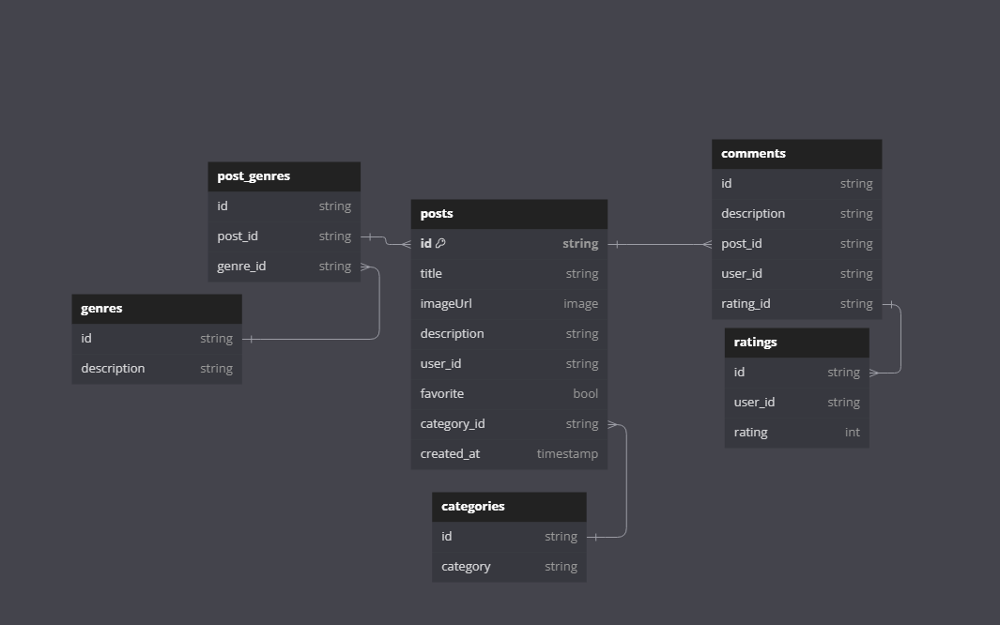
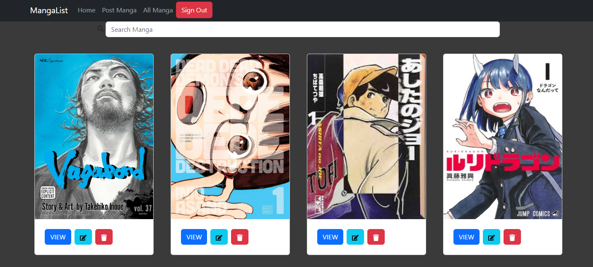

# Overview
Welcome to MangaList, your go-to app for tracking and organizing your manga reading journey! Whether you're a seasoned manga enthusiast or just starting out, MangaList makes it easy to manage your collection, discover new titles, and connect with fellow fans.

## Features
Create posts about the manga in your collection and easily log the manga you own, are currently reading
Read all the posts by other people as well
Update your manga and change the information
Delete manga that you no longer care for from your collection

## Technologies Used
React.js, Next.js, Firebase, CSS, React-bootstrap

### erd

### app screenshot 

